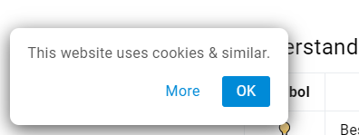
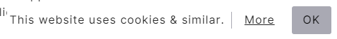
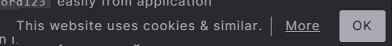
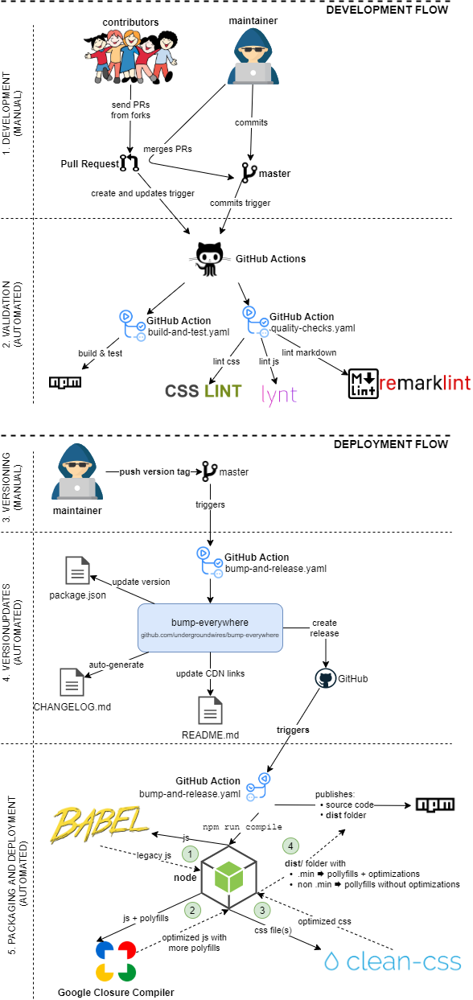

# ez-consent

> 🍪 A minimal, vanilla JavaScript cookie consent banner with no dependencies.

[](https://www.npmjs.com/package/ez-consent)
[](https://www.jsdelivr.com/package/npm/ez-consent)
[](https://github.com/undergroundwires/ez-consent/issues)
[](./.github/workflows/publish.yaml)
[](./.github/workflows/build-and-test.yaml)
[](./.github/workflows/bump-and-release.yaml)
[](./.github/workflows/quality-checks.yaml)
[](https://github.com/undergroundwires/bump-everywhere)
<!-- [](https://www.npmjs.com/package/ez-consent) -->

- Vanilla JavaScript only ✔️
- It does not track you ✔️
- Very lightweight with no dependencies ✔️
- Single line to get started ✔️

Examples:

- [Live example 1](https://privacylearn.com/?force-consent)
- [Live example 2](https://erkinekici.com/?force-consent)
- [CodePen examples](https://codepen.io/collection/XRjMGP)

## Usage

1. [Import](#1-import-the-script)
2. [Initialize](#2-initialize-the-script)
3. [Style](#3-style)

### 1. Import the script

#### Option A: CDN

It's the simplest way. Just add it to your page:

```html
<script type="text/javascript" src="https://cdn.jsdelivr.net/npm/ez-consent@1/dist/ez-consent.min.js"></script>
```

#### Option B: Install

- Using NPM: `npm install ez-consent --save`
- Or using yarn: `yarn add ez-consent`
- Or as a git submodule (not recommended):
  - Go to the folder you wish to have the repository
  - Run `git submodule add https://github.com/undergroundwires/safe-email`

Add it to your page:

```html
<script type="text/javascript" src="/node_modules/ez-consent/dist/ez-consent.min.js"></script>
```

Or you can import `ez_consent` as a module:

```html
<script type="module">
  import { ez_consent } from './ez-consent/src/ez-consent.js'; // /node_modules/ez-consent/ez-consent.js ...
  ez_consent.init();
</script>
```

Or import it via `webpack`, `gulp`, `rollup` etc.:

```js
import { ez_consent } from "./node_modules/ez-consent/src/ez-consent"
```

*[top↑](#ez-consent)*

### 2. Initialize the script

```js
ez_consent.init();
```

or with all optional options:

```js
ez_consent.init(
  {
    is_always_visible: false,       // Always shows banner on load, default: false
    privacy_url: "/privacy",        // URL that "more" button goes to, default: "/privacy/"
    more_button: {
      target_attribute : "_blank",  // Determines what the behavior of the 'more' button is, default: "_blank", opens the privacy page in a new tab
      is_consenting: true           // Controls whether clicking the 'more' button automatically gives consent and removes the banner, default: true
    },
    texts: {
      main: "We use cookies",       // The text that's shown on the banner, default: "This website uses cookies & similar."
      buttons:
      {
        ok: "ok",                   // OK button to hide the text, default: "ok"
        more: "more"                // More/accept button that shows the privacy policy, default "more"
      }
    },
    css_classes: {                  // CSS class name overrides
      container: 'container',       // Main container element, default: "cookie-consent"
      message_text: 'mainText',     // Main message text container, default: "cookie-consent__text"
      buttons: {
        wrapper: 'buttonsWrapper',  // Button container, default: "cookie-consent__buttons"
        more: 'moreButton',         // More info button, default: "cookie-consent__buttons-button cookie-consent__buttons__read-more"
        ok: 'okButton',             // More/accept button, default: "cookie-consent__buttons-button cookie-consent__buttons__close"
      },
    },
  });
```

The banner will be shown if the user has not yet agreed to read & understand the information.
You can force the banner to always show by including the `force-consent` query parameter in the URL.
Example for `https://test.com/fest` page: `test.com/fest?force-consent`.

*[top↑](#ez-consent)*

### 3. Style

#### Existing themes

You can choose one of the following existing theme to begin:

##### box-bottom-left.css



[Source file](./src/themes/box-bottom-left.css) | [See it live](https://cloudarchitecture.io/?force-consent) | [Preview on CodePen](https://codepen.io/undergroundwires/pen/qBdzmyj)

```html
<link rel="stylesheet" href="https://cdn.jsdelivr.net/npm/ez-consent@1/dist/themes/box-bottom-left.min.css">
```

##### subtle-bottom-right.css




[Source file](./src/themes/subtle-bottom-right.css) | [See it live](https://erkinekici.com/?force-consent) | [Preview on CodePen](https://codepen.io/undergroundwires/pen/MWwMmqw)

```html
<link rel="stylesheet" href="https://cdn.jsdelivr.net/npm/ez-consent@1/dist/themes/subtle-bottom-right.min.css">
```

#### Custom themes

Or you can create your own theme & import it. Check example themes at [existing themes](./src/themes/). [The HTML](./src/ez-consent.js#L18) uses only a few classes using [BEM](http://getbem.com/naming/) naming convention.

You're welcome to contribute your theme to the project in [`./src/themes`](./src/themes/) folder by creating a pull request 👍.

*[top↑](#ez-consent)*

## Distributed files

The repository and deployed packages include a `dist/` folder that adds polyfills to the files and distributes them as:

- minified (`.min.js`, `.min.css`) files for production usage
- non-minified (`.js`, `.css`) files for debugging

*[top↑](#ez-consent)*

## GitOps

CI/CD is fully automated for this repo using different Git events & GitHub actions.



*[top↑](#ez-consent)*
