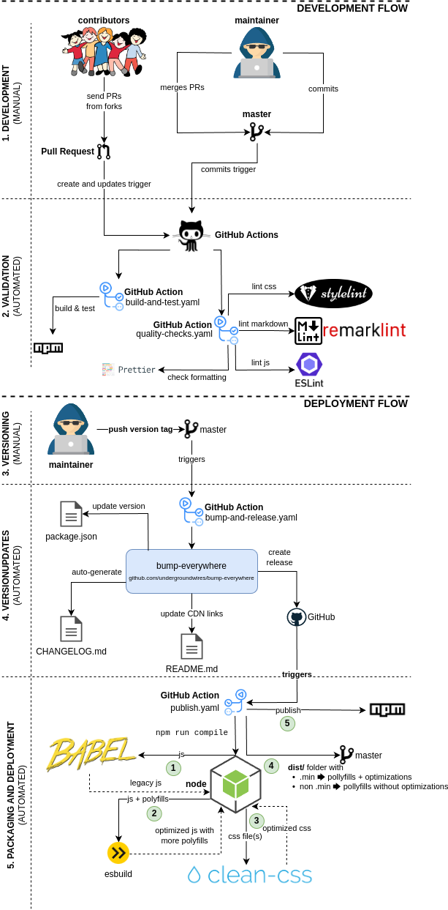

# ez-consent

>  A minimal, vanilla JavaScript cookie consent banner with no dependencies.

<!-- Package information -->

[](https://www.npmjs.com/package/ez-consent)
[](https://www.jsdelivr.com/package/npm/ez-consent)


<!-- [](https://www.npmjs.com/package/ez-consent) -->

- Vanilla JavaScript only ✔️
- It does not track you ✔️
- Very lightweight with no dependencies ✔️
- Single line to get started ✔️
- Everything customizable, including language ✔️
- Supports [Google consent mode](https://support.google.com/google-ads/answer/10000067?hl=en) ✔️

Examples:

- [Live example 1](https://privacylearn.com/?force-consent)
- [Live example 2](https://erkinekici.com/?force-consent)
- [CodePen examples](https://codepen.io/collection/XRjMGP)

<!-- Development status -->

[](https://github.com/undergroundwires/ez-consent/issues)
[](./.github/workflows/publish.yaml)
[](./.github/workflows/build-and-test.yaml)
[](./.github/workflows/bump-and-release.yaml)
[](./.github/workflows/quality-checks.yaml)
[](https://github.com/undergroundwires/bump-everywhere)

## Usage

### Quick Start: CDN

The simplest way to get started is to add it to your page:

```html
<script
  type="text/javascript"
  src="https://cdn.jsdelivr.net/npm/ez-consent@^1/dist/ez-consent.min.js"
  defer
  async
  onload="
        ez_consent.init({
            privacy_url: '/privacy',
            texts: {
                buttons: {
                    ok: 'OK',
                    more: 'More',
                },
            },
        });
    "
></script>
```

See [Initialize the script](#2-initialize) for additional options and alternative ways.

_[top↑](#ez-consent)_

### Advanced Usage

1. [Import](#1-import)
2. [Initialize](#2-initialize)
3. [Style](#3-style) (optional)

#### 1. Import

Here are some examples how you can install the script:

- Using NPM: `npm install ez-consent --save`
- Or using yarn: `yarn add ez-consent`
- Using git submodule (not recommended):
  - Go to the folder you wish to have the repository
  - Run `git submodule add https://github.com/undergroundwires/safe-email`

Add it to your page:

```html
<script
  type="text/javascript"
  src="/node_modules/ez-consent/dist/ez-consent.min.js"
></script>
```

Or you can import `ez_consent` as a module:

```html
<script type="module" async defer>
  import { ez_consent } from './ez-consent/src/ez-consent.js'; // /node_modules/ez-consent/ez-consent.js ...
  ez_consent.init();
</script>
```

Or import it via `webpack`, `gulp`, `rollup` etc.:

```js
import { ez_consent } from './node_modules/ez-consent/src/ez-consent';
```

_[top↑](#ez-consent)_

#### 2. Initialize

When importing a script using the `<script>` element, it's recommended to use the `onload` attribute to initialize it.
This approach allows you to keep both `async` and `defer` attributes, which improve webpage performance and user
experience by optimizing script loading. This can help your pages rank better in search engines.

```html
<script
  type="text/javascript"
  src="/node_modules/ez-consent/dist/ez-consent.min.js"
  async
  defer
  onload="
        ez_consent.init({
            privacy_url: '/privacy',
            texts: {
                buttons: {
                    ok: 'OK',
                    more: 'More',
                },
            },
        });
    "
></script>
```

Or, you can initialize later using this snippet:

```js
ez_consent.init();
```

See all options:

```js
ez_consent.init({
  is_always_visible: false, // Always shows banner on load, default: false
  privacy_url: '/privacy', // URL that "more" button goes to, default: "/privacy/"
  consent_duration: 'P10Y', // Consent duration (cookie expiry date), default: 10 years. ISO 8601 format, decimals are not supported.
  enable_google_consent_mode: false, // Sends consent state to Google (enables Google consent mode)
  more_button: {
    target_attribute: '_blank', // Determines what the behavior of the 'more' button is, default: "_blank", opens the privacy page in a new tab
    is_consenting: true, // Controls whether clicking the 'more' button automatically gives consent and removes the banner, default: true
  },
  texts: {
    main: 'We use cookies', // The text that's shown on the banner, default: "This website uses cookies & similar."
    buttons: {
      ok: 'ok', // OK button to hide the text, default: "ok"
      more: 'more', // More/accept button that shows the privacy policy, default "more"
    },
  },
  css_classes: {
    // CSS class name overrides
    container: 'container', // Main container element, default: "cookie-consent"
    message_text: 'mainText', // Main message text container, default: "cookie-consent__text"
    buttons: {
      wrapper: 'buttonsWrapper', // Button container, default: "cookie-consent__buttons"
      more: 'moreButton', // More info button, default: "cookie-consent__button cookie-consent__button--more"
      ok: 'okButton', // More/accept button, default: "cookie-consent__button cookie-consent__button--ok"
    },
  },
});
```

The banner will be shown if the user has not yet agreed to read & understand the information.
You can force the banner to always show by including the `force-consent` query parameter in the URL.
Example for `https://test.com/fest` page: `test.com/fest?force-consent`.

_[top↑](#ez-consent)_

#### 3. Style

##### Existing Themes

You can choose one of the following existing themes to begin:

###### box-bottom-left.css


[Source file](./src/themes/box-bottom-left.css) | [See it live](https://cloudarchitecture.io/?force-consent) | [Preview on CodePen](https://codepen.io/undergroundwires/pen/qBdzmyj)

```html
<link
  rel="stylesheet"
  href="https://cdn.jsdelivr.net/npm/ez-consent@^1/dist/themes/box-bottom-left.min.css"
/>
```

###### subtle-bottom-right.css


[Source file](./src/themes/subtle-bottom-right.css) | [See it live](https://erkinekici.com/?force-consent) | [Preview on CodePen](https://codepen.io/undergroundwires/pen/MWwMmqw)

```html
<link
  rel="stylesheet"
  href="https://cdn.jsdelivr.net/npm/ez-consent@1/dist/themes/subtle-bottom-right.min.css"
/>
```

##### Custom Themes

Or you can create your own theme & import it. Check example themes at [existing themes](./src/themes/). [The HTML](./src/ez-consent.js#L18) uses only a few classes using [BEM](https://getbem.com/naming/) naming convention.

You can also add your own class names using `css_classes` option, see [initialization](#2-initialize) for details.

You're welcome to contribute your theme to the project in [`./src/themes`](./src/themes/) folder by creating a pull request 👍.

_[top↑](#ez-consent)_

## Distributed files

The repository and deployed packages include a `dist/` folder that adds polyfills to the files and distributes them as:

- minified (`.min.js`, `.min.css`) files for production usage
- non-minified (`.js`, `.css`) files for debugging

_[top↑](#ez-consent)_

## GitOps

CI/CD is fully automated for this repo using different Git events & GitHub actions.



_[top↑](#ez-consent)_
